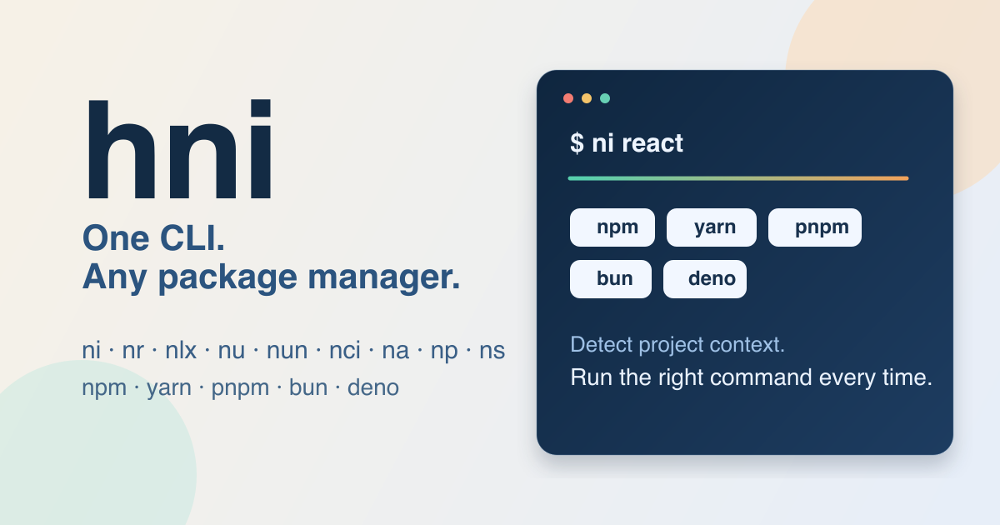

# hni



[](https://github.com/happytoolin/hni/actions/workflows/ci.yml)
[](https://opensource.org/licenses/MIT)
[](https://crates.io/crates/hni)
[](https://www.npmjs.com/package/hni)


Fast package manager routing for `npm`, `yarn`, `pnpm`, `bun`, and `deno`.

`hni` is inspired by Antfu's [`ni`](https://github.com/antfu-collective/ni#readme), but packaged as a single multicall binary with extra shell setup for a `node` shim.

One install gives you:

- `hni`
- `ni`, `nr`, `nlx`, `nu`, `nun`, `nci`, `na`, `np`, `ns`
- `node` (shim mode)

## Install

### Homebrew

```bash
brew tap happytoolin/happytap
brew install hni
hni --version
```

### Script install (macOS / Linux)

```bash
curl -fsSL https://happytoolin.com/hni/install.sh | bash
```

Optional environment variables:

- `HNI_VERSION` - install a specific version, for example `v0.0.1`
- `HNI_INSTALL_DIR` - install somewhere other than `~/.local/bin`

### Script install (PowerShell)

```powershell
irm https://happytoolin.com/hni/install.ps1 | iex
```

Optional parameters:

- `-Version latest`
- `-InstallDir "$env:LOCALAPPDATA\hni\bin"`

## Commands

### `ni`

Install dependencies or add new ones.

```bash
ni
ni vite
ni -D vitest
ni -g eslint
ni --frozen
ni --frozen-if-present
ni --interactive
```

### `nr`

Run package scripts.

```bash
nr
nr dev
nr build
nr test -- --watch
nr --if-present lint
nr --repeat-last
```

### `nlx`

Execute binaries without adding them permanently to your project.

```bash
nlx vitest
nlx eslint .
nlx create-vite@latest
```

### `nu`

Upgrade dependencies.

```bash
nu
nu react react-dom
nu --interactive
```

### `nun`

Remove dependencies.

```bash
nun lodash
nun react react-dom
nun --multi-select
nun -g typescript
```

### `nci`

Run a clean install. If a lockfile exists, `hni` uses the package-manager-specific frozen install command.

```bash
nci
```

### `na`

Print or forward directly to the detected package manager.

```bash
na --version
na config get registry
```

### `np` / `ns`

Run shell commands in parallel or sequentially.

```bash
np "pnpm dev" "pnpm test"
ns "pnpm lint" "pnpm test"
```

### `node`

`hni` can also act as a package-manager-aware `node` shim.

```bash
node install vite
node run dev
node exec vitest
node ci
node p "echo one" "echo two"
```

Regular Node.js usage still passes through:

```bash
node script.js
node -v
node -- --trace-warnings
```

### Utilities

```bash
hni help ni
hni completion zsh
hni init bash
hni doctor
```

## Shell Setup

If you want `hni` to win command lookup for `node`, add the init line at the end of your shell config file, after anything that manages Node or rewrites `PATH`, such as `nvm`, `mise`, `asdf`, `fnm`, or `volta`.

Do not append the `hni` directory to the end of `PATH`. Put the init line at the end of the shell config file and let it prepend the correct path for you.

### zsh

Add to `~/.zshrc`:

```bash
eval "$(hni init zsh)"
```

### bash

Add to `~/.bashrc`:

```bash
eval "$(hni init bash)"
```

### fish

Add to `~/.config/fish/config.fish`:

```fish
hni init fish | source
```

### PowerShell

Add to `$PROFILE`:

```powershell
Invoke-Expression (& hni init powershell)
```

### Nushell

Generate a stable init file, then source it from the end of `~/.config/nushell/config.nu`:

```nu
hni init nushell | save --force ~/.config/nushell/hni.nu
source ~/.config/nushell/hni.nu
```

## Global Flags

These work across `hni` and the multicall aliases:

```bash
? --dry-run --print-command
--explain
-C <dir>
-v --version
-h --help
```

Use `--` to forward flags to the underlying package manager or script:

```bash
hni ni -- --help
nr test -- --watch
```

## Configuration

Config file:

- `~/.hnirc`

Supported keys:

```ini
defaultAgent=prompt
globalAgent=npm
runAgent=node
useSfw=false
```

Environment overrides:

- `HNI_CONFIG_FILE`
- `HNI_DEFAULT_AGENT`
- `HNI_GLOBAL_AGENT`
- `HNI_USE_SFW`
- `HNI_AUTO_INSTALL`

## How It Works

`hni` detects the package manager from:

1. `packageManager` in `package.json`
2. lockfiles such as `pnpm-lock.yaml`, `yarn.lock`, `package-lock.json`, `bun.lockb`, or `deno.lock`
3. config defaults if detection is unavailable

Then it maps the command family to the right native command:

- `ni` -> install or add
- `nr` -> run or task
- `nlx` -> `npx` / `pnpm dlx` / `yarn dlx` / `bun x`
- `nu` -> update / upgrade
- `nci` -> frozen install when lockfiles exist

## Troubleshooting

### PowerShell `ni` alias conflict

PowerShell ships with a built-in `ni` alias for `New-Item`.

If that conflicts with `hni`, remove or override it in your profile before loading `hni`:

```powershell
Remove-Item Alias:ni -ErrorAction SilentlyContinue
Invoke-Expression (& hni init powershell)
```

### Check what `hni` resolved

```bash
ni vite --debug-resolved
nr dev --explain
hni doctor
```
