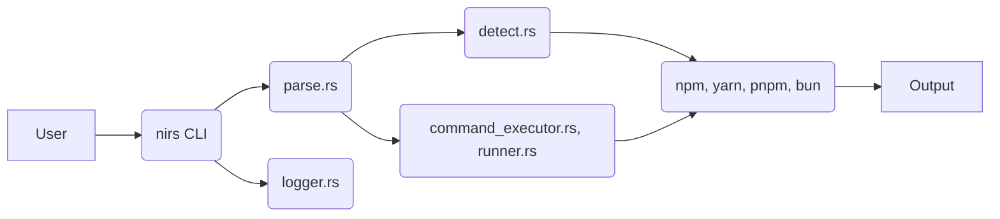

# System Patterns: nirs

**Architecture:** `nirs` follows a command-line interface (CLI) architectural pattern. It receives commands from the user, parses them, detects the appropriate package manager, and executes the corresponding command.

**Key Technical Decisions:**

- **Package Manager Detection:** `nirs` uses a lock file detection mechanism to determine the package manager used in a project. The order of detection is: bun, pnpm, yarn, npm.
- **Command Parsing:** `nirs` uses a parsing module (`src/parse.rs`) to translate the unified `nirs` commands into package manager-specific commands.
- **Command Execution:** `nirs` uses a command execution module (`src/command_executor.rs` and `src/runner.rs`) to run the translated commands.
- **Logging:** `nirs` uses a logging module (`src/logger.rs`) to provide detailed information about its operations.
- **Configuration:** `nirs` uses a configuration file (`.nirc`) and environment variables to allow users to customize its behavior (e.g., default package manager).

**Component Relationships:**

**Design Patterns:**

- **Strategy Pattern:** The package manager detection and command execution logic uses a strategy pattern, where different strategies are implemented for each package manager.
- **Facade Pattern:** The `nirs` CLI provides a simplified facade over the complex logic of package manager detection and command execution.
